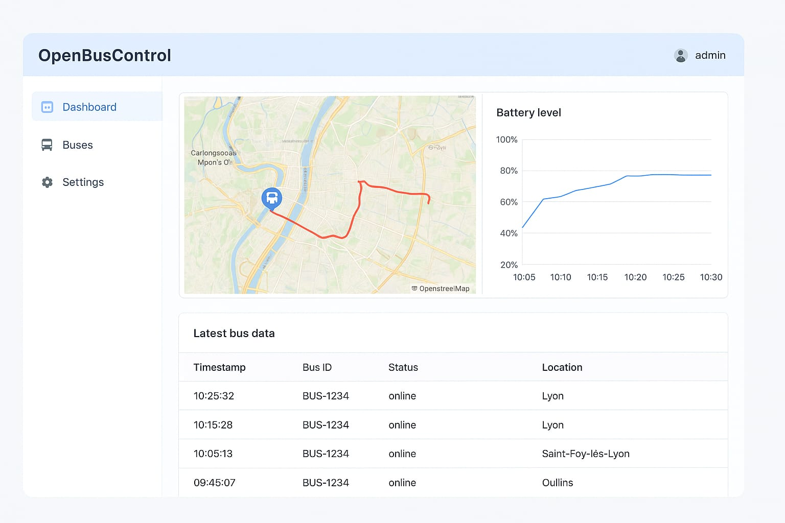

# OpenVehicleControl

[](https://www.gnu.org/licenses/agpl-3.0)
[](https://www.python.org/downloads/)
[](https://reactjs.org/)
[](https://www.docker.com/)

> **OpenVehicleControl** is an open-source platform for comprehensive vehicle fleet management, real-time telemetry, and connected mobility infrastructure. Born from the need to democratize vehicle control technology, this project provides a complete ecosystem for monitoring, commanding, and analyzing electric and connected vehicles.

## 🌟 Key Features

- **Multi-Vehicle Support**: From electric buses to personal EVs, scooters, and utility vehicles
- **Real-Time Telemetry**: High-frequency data collection via OBD-II, CAN, and modern protocols
- **Secure Command & Control**: Digitally signed commands with end-to-end security
- **IoT Edge Agent**: Lightweight embedded software for vehicle-side operations
- **Modern Web Interface**: React-based dashboard with real-time visualization
- **Standards Compliance**: ISO 15118, OCPP, SAE J1979, UDS, and more
- **Open Architecture**: REST APIs, MQTT, WebSocket for seamless integration

## 🎨 Project Overview

### Platform Banner


### System Architecture


*OpenVehicleControl's distributed architecture connects vehicles through IoT edge agents to cloud platforms, enabling comprehensive fleet management and real-time control.*

## 🚀 Quick Start

### Prerequisites
- Docker & Docker Compose
- Python 3.9+
- Node.js 18+ (for frontend development)

### Local Development Setup

```bash
# Clone the repository
git clone https://github.com/your-org/openvehiclecontrol.git
cd openvehiclecontrol

# Start the complete stack
docker-compose up -d

# Access the dashboard
open http://localhost:3000

# API documentation
open http://localhost:8000/docs
```

### First Vehicle Connection

```python
from openvehiclecontrol import VehicleAgent

# Connect to a vehicle via OBD-II
agent = VehicleAgent(vehicle_id="bus-001", protocol="obd2")
agent.connect(port="/dev/ttyUSB0")

# Start telemetry streaming
agent.start_telemetry(interval=100)  # 100ms intervals
```

## 📚 Documentation Structure

This comprehensive documentation follows a pedagogical approach, building understanding progressively from fundamental concepts to advanced implementations:

### Core Documentation
- **[📖 Introduction](./docs/01-introduction.md)** - Project vision, origins, and philosophy
- **[⚙️ Architecture](./docs/02-architecture.md)** - System overview and data flows
- **[🧠 Backend API](./docs/03-backend-api.md)** - Server architecture and data models
- **[🖥️ Frontend Dashboard](./docs/04-frontend-dashboard.md)** - User interface and visualization

### Technical Deep Dives
- **[🔌 IoT Vehicle Agent](./docs/05-iot-agent.md)** - Embedded software and protocols
- **[🧩 Protocols & Standards](./docs/06-protocols-standards.md)** - Automotive communication standards
- **[🔒 Security & Compliance](./docs/07-security-compliance.md)** - Cybersecurity and regulations
- **[🧮 Data & Analytics](./docs/08-data-analytics.md)** - Telemetry processing and insights

### Development & Deployment
- **[🧰 Development Tools](./docs/09-development-tools.md)** - CI/CD, testing, monitoring
- **[🚗 Extensions & Modules](./docs/10-extensions-modules.md)** - Vehicle integrations and plugins
- **[🧩 Testing & Simulation](./docs/11-testing-simulation.md)** - Development and validation tools
- **[🌍 Deployment & Infrastructure](./docs/12-deployment-infrastructure.md)** - Production deployment strategies

### Community & Future
- **[🤝 Governance & Community](./docs/13-governance-community.md)** - Open source management
- **[🧭 Roadmap](./docs/14-roadmap.md)** - Development milestones and vision
- **[📄 Appendices](./docs/15-appendices.md)** - Technical references and examples

## 🏗️ System Architecture

```
┌─────────────────┐    ┌──────────────────┐    ┌─────────────────┐
│   Vehicles      │    │  IoT Edge Agent  │    │   Cloud Platform │
│   (OBD-II, CAN) │◄──►│  (MQTT, WebSock) │◄──►│   (FastAPI, DB)  │
└─────────────────┘    └──────────────────┘    └─────────────────┘
         │                       │                       │
         └───────────────────────┼───────────────────────┘
                                 ▼
                    ┌─────────────────────┐
                    │  Operator Dashboard │
                    │    (React, Maps)    │
                    └─────────────────────┘
```

## 🎯 Use Cases

### Public Transportation
- **Real-time fleet monitoring** for electric buses
- **Predictive maintenance** using telemetry data
- **Energy optimization** and eco-driving analytics
- **Passenger information** systems integration

### Electric Vehicle Fleets
- **Charge management** across distributed stations
- **Load balancing** with smart grid integration
- **Remote diagnostics** and firmware updates
- **Usage analytics** for operational efficiency

### Research & Development
- **Protocol testing** environments
- **Data collection** for automotive research
- **Simulation frameworks** for new vehicle designs
- **Standards validation** tooling

## 🤝 Contributing

We welcome contributions from the automotive, IoT, and open-source communities. Our pedagogical approach ensures that documentation and code are accessible to newcomers while maintaining professional standards.

See our [Contributing Guide](./CONTRIBUTING.md) for detailed information on:
- Development setup and workflows
- Code standards and testing
- Documentation guidelines
- Review processes

## 📄 License

This project is licensed under the **GNU Affero General Public License v3.0 (AGPLv3)** - see the [LICENSE](LICENSE) file for details.

The AGPLv3 ensures that:
- All modifications remain open source
- Network usage triggers copyleft provisions
- Commercial adoption requires contribution back to the community

## 🙏 Acknowledgments

OpenVehicleControl builds upon decades of automotive standards work by ISO, SAE, and IEEE. We're grateful to the open-source community for providing the foundational tools that make this project possible.

---

*This documentation follows a comprehensive pedagogical approach, ensuring that complex automotive and IoT concepts are explained with detailed analogies, progressive complexity, and practical examples. Each chapter builds upon previous knowledge while maintaining accessibility for both newcomers and experts.*
